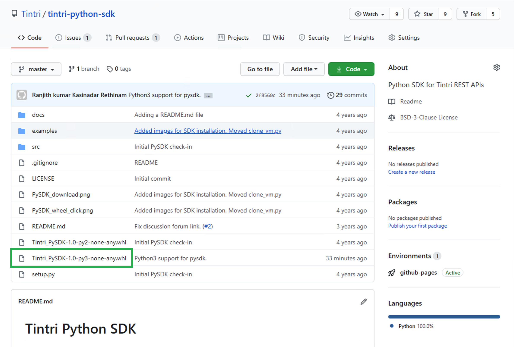
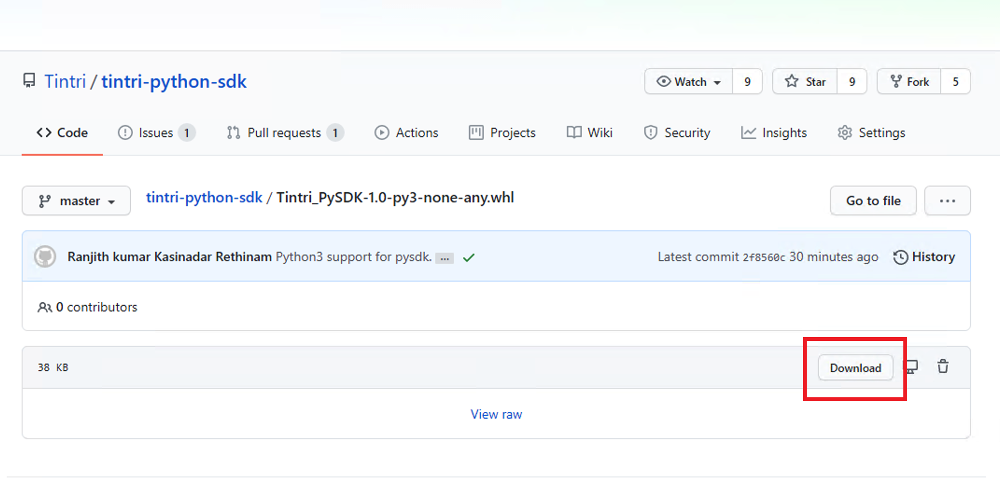
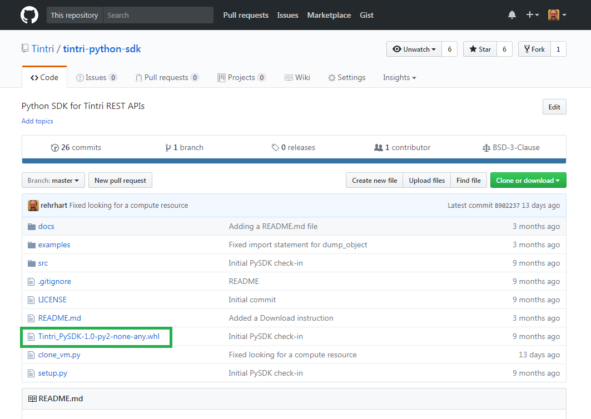
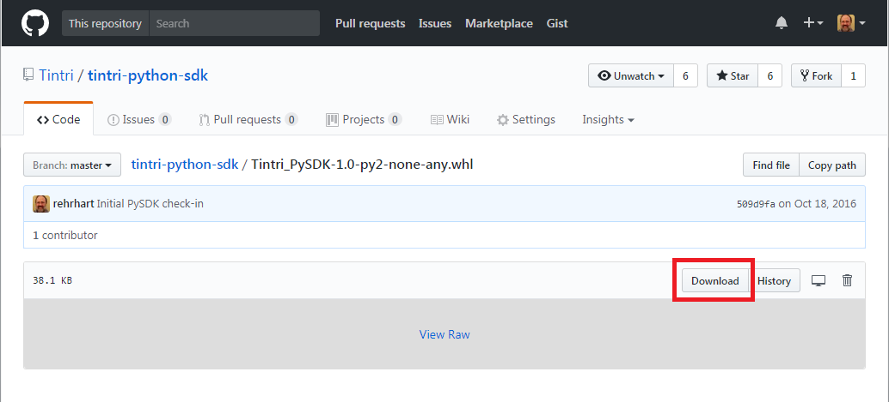

# Tintri Python SDK
A Python SDK (PySDK) for integrating with Tintri's REST APIs.

Currently works with Python 3.6 and 2.7

## Documentation ##
The PySDK documentation is located [here](https://tintri.github.io/tintri-python-sdk/index.html).

## Installing the SDK on Python 3.6
1. Click Tintri_PySDK-1.0-py3-none-any.whl. (see image below)

1. Click Download. (see image below)

1. [sudo] pip3 install Tintri_PySDK-1.0-py3-none-any.whl

## Installing the SDK on Python 2.7
1. Click Tintri_PySDK-1.0-py2-none-any.whl. (see image below)

1. Click Download. (see image below)

1. [sudo] pip install Tintri_PySDK-1.0-py2-none-any.whl

## Questions or Comments ##
For questions and comments, please go to the [Tintri Hub Automation Discussion Group](http://hub.tintri.com/discussions/automation).
